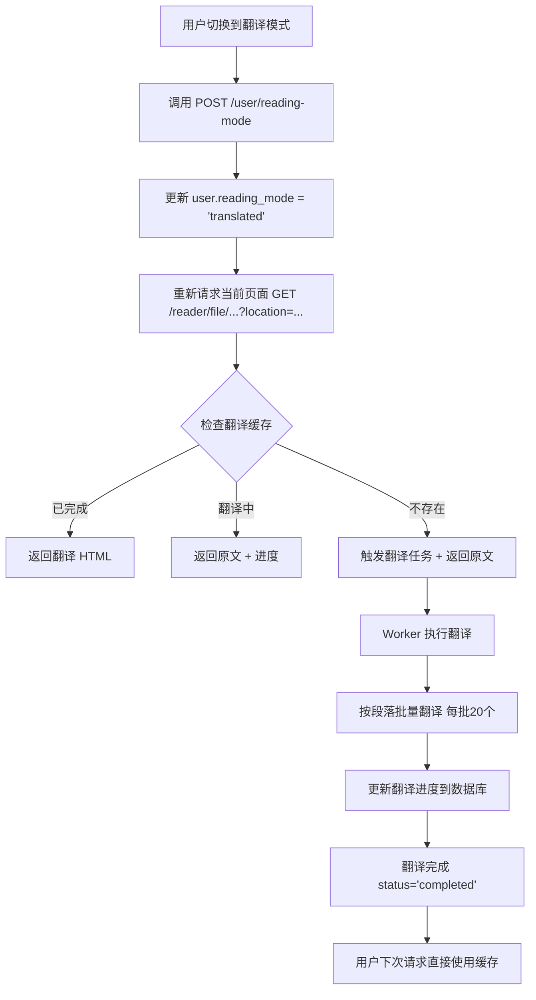

# Library 模块文档

> **模块职责**：内容摄入（EPUB/PDF/URL）、存储、检索、推荐。核心是将各种格式转换为带 span_id 的 HTML，支持精确定位和智能推荐。

---

## 核心原则

### HTML 作为唯一真实来源（Single Source of Truth）

- 所有文本内容存储在简化后的内部标准 HTML 文件中
- span_id 嵌入在 HTML 中，提供句子级定位能力
- 元数据（Leaf、Highlight、Question）存储在数据库，引用 span_id
- 无冗余文本拷贝

### 虚拟切分（Virtual Splitting）

- Leaf 不存储文本副本，只存储 span 指针（`span_ranges`）
- 使用时通过 `LeafHTMLReconstructor` 从 HTML 实时重建（JIT）
- 好处：HTML 更新时无需同步更新 Leaf 文本

### 内容寻址（Content Addressing）

- `content_id = sha256(file_bytes)[:16]`（16位 hash）
- 自动去重，相同文件只入库一次
- 文件修改后会生成新的 content_id

---

## 数据模型

### PostgreSQL 表结构

```sql
-- 内容元数据
CREATE TABLE contents (
    content_id TEXT PRIMARY KEY,       -- sha256[:16]
    uid TEXT NOT NULL,                 -- 上传用户
    title TEXT,
    author TEXT,
    source TEXT,                       -- EPUB/PDF/URL
    file_count INT,                    -- HTML 文件数量
    toc_json TEXT,                     -- 带 span_id 的目录
    outline_json TEXT DEFAULT '[]',    -- AI 生成的多层级大纲
    status TEXT,                       -- PENDING/PARSED/ANALYZED
    created TIMESTAMP,
    updated TIMESTAMP
);

-- 虚拟切分结果
CREATE TABLE leaves (
    leaf_id TEXT PRIMARY KEY,
    content_id TEXT REFERENCES contents(content_id),
    file_idx INT,                      -- 所属文件索引
    leaf_idx INT,                      -- Leaf 在文件内的顺序
    span_ranges TEXT[],                -- span 指针数组 ["p1-s1:p1-s5", "p2-s1:p2-s3"]
    outline_json TEXT DEFAULT '[]',    -- AI 生成的 Leaf 大纲
    char_count INT,
    created TIMESTAMP,

    UNIQUE(content_id, file_idx, leaf_idx)
);

-- 精读摘录索引（LLM 提取）
CREATE TABLE highlights (
    id TEXT PRIMARY KEY,               -- "highlight-{uuid}"
    content_id TEXT,
    leaf_id TEXT,
    location TEXT[] NOT NULL,          -- span_id 列表
    text TEXT NOT NULL,                -- 摘录文本
    category TEXT,                     -- Emotion/Insight/Instruction
    created TIMESTAMP
);

-- 问题索引（LLM 生成）
CREATE TABLE questions (
    id TEXT PRIMARY KEY,               -- "question-{uuid}"
    content_id TEXT,
    leaf_id TEXT,
    location TEXT[] NOT NULL,          -- span_id 列表
    question TEXT NOT NULL,
    answer_hint TEXT,                  -- 答案提示
    owner_uid TEXT,                    -- 个性化分析标识（NULL=通用分析）
    created TIMESTAMP
);

-- ===== 频道系统（Channel System） =====

-- 频道表
CREATE TABLE channels (
    id TEXT PRIMARY KEY,               -- "channel-{uuid}"
    name TEXT NOT NULL,
    description TEXT DEFAULT '',
    creator_uid TEXT NOT NULL,
    creator_type TEXT DEFAULT 'user',  -- user|system|ai
    is_public BOOLEAN DEFAULT false,   -- 公开/私有
    created_at TIMESTAMP DEFAULT CURRENT_TIMESTAMP,
    updated_at TIMESTAMP DEFAULT CURRENT_TIMESTAMP
);

-- 频道-内容关系
CREATE TABLE channel_contents (
    channel_id TEXT NOT NULL REFERENCES channels(id) ON DELETE CASCADE,
    content_id TEXT NOT NULL REFERENCES contents(content_id) ON DELETE CASCADE,
    added_at TIMESTAMP DEFAULT CURRENT_TIMESTAMP,
    added_by TEXT,                     -- uid 或 'system'
    PRIMARY KEY (channel_id, content_id)
);

-- 频道订阅
CREATE TABLE channel_subscriptions (
    uid TEXT NOT NULL,
    channel_id TEXT NOT NULL REFERENCES channels(id) ON DELETE CASCADE,
    subscribed_at TIMESTAMP DEFAULT CURRENT_TIMESTAMP,
    PRIMARY KEY (uid, channel_id)
);

-- Topic 订阅（配合 Brain 模块）
CREATE TABLE topic_subscriptions (
    uid TEXT NOT NULL,
    topic_id TEXT NOT NULL,            -- 引用 Neo4j Topic UUID
    subscribed_at TIMESTAMP DEFAULT CURRENT_TIMESTAMP,
    PRIMARY KEY (uid, topic_id)
);
```

**字段说明**：

- **contents.uploader_uid**: 用户上传标识（"稍后阅读" = "用户上传"）
- **highlights/questions.owner_uid**: 个性化分析标识
  - `NULL`: 通用分析（公开频道，所有人可见）
  - `{uid}`: 个性化分析（私有频道，仅该用户可见）
- **channels.is_public**: 控制分析类型
  - `true`: 使用通用分析（LeafAnalyzer）
  - `false`: 触发个性化分析（PersonalizedLeafAnalyzer）
```

**翻译系统表**：
```sql
-- Content 元数据翻译
CREATE TABLE content_translations (
    content_id TEXT NOT NULL REFERENCES contents(id) ON DELETE CASCADE,
    target_language TEXT NOT NULL,  -- 'zh' | 'en'

    -- 翻译字段
    title TEXT,
    author TEXT,
    abstract TEXT,
    summary TEXT,
    outline_json TEXT,
    toc_json TEXT,

    -- 元数据
    translated_at TIMESTAMP DEFAULT CURRENT_TIMESTAMP,
    translation_model TEXT DEFAULT 'gpt-4o',

    PRIMARY KEY (content_id, target_language)
);

-- HTML 文件翻译（按文件存储）
CREATE TABLE html_file_translations (
    content_id TEXT NOT NULL,
    file_index INTEGER NOT NULL,
    target_language TEXT NOT NULL,

    -- 翻译结果
    translated_html TEXT,           -- 完整翻译后的 HTML
    paragraph_translations JSONB,   -- 段落级翻译映射（用于增量更新）

    -- 进度跟踪
    total_paragraphs INTEGER DEFAULT 0,
    translated_paragraphs INTEGER DEFAULT 0,
    progress REAL GENERATED ALWAYS AS (
        CASE WHEN total_paragraphs > 0
        THEN translated_paragraphs::REAL / total_paragraphs::REAL
        ELSE 0 END
    ) STORED,

    -- 状态
    status TEXT DEFAULT 'pending',  -- 'pending' | 'translating' | 'completed' | 'failed'
    error_message TEXT,

    -- 元数据
    started_at TIMESTAMP,
    completed_at TIMESTAMP,
    translation_model TEXT DEFAULT 'gpt-4o',

    PRIMARY KEY (content_id, file_index, target_language),
    FOREIGN KEY (content_id) REFERENCES contents(id) ON DELETE CASCADE
);
```

**设计要点**：
- **按文件粒度**：HTML 文件独立翻译，缓存复用
- **增量翻译**：`paragraph_translations` 存储段落级进度
- **幂等性**：支持任务重试，防止重复翻译
- **语言检测**：`contents.source_language` 自动检测（'auto'|'zh'|'en'）

### Milvus 向量集合

```python
# highlights_vectors
{
    "id": VARCHAR(64),                 # highlight-{uuid}
    "content_id": VARCHAR(32),
    "vector": FLOAT_VECTOR(3072),
}

# questions_vectors
{
    "id": VARCHAR(64),                 # question-{uuid}
    "content_id": VARCHAR(32),
    "vector": FLOAT_VECTOR(3072),
}
```

### 本地文件系统

```
/Resonote-data/library_html/{content_id}/
├── 0.html    # 第一个文件
├── 1.html    # 第二个文件
├── 2.html    # 第三个文件
└── ...
```

**HTML 内容示例**：
```html
<h2 id="8846e1c91c58abcd-1-p1">
  <span id="8846e1c91c58abcd-1-p1-s1">Chapter Title</span>
</h2>
<p id="8846e1c91c58abcd-1-p2">
  <span id="8846e1c91c58abcd-1-p2-s1">This is the first sentence.</span>
  <span id="8846e1c91c58abcd-1-p2-s2">This is the second sentence.</span>
</p>
```

### span_id 格式

```
{content_id}-{file_idx}-p{paragraph}-s{sentence}

示例：8846e1c91c58abcd-1-p5-s2
解析：
  - content_id: 8846e1c91c58abcd（16位 hash）
  - file_idx: 1 → 对应 1.html
  - paragraph: 5 → 第5个段落
  - sentence: 2 → 段落内第2个句子
```

**关键约束**：span_id 一旦生成，**永不修改**（用户标注依赖它）

---

## 摄取流程

### 两阶段架构

```
阶段 1: 摄取（Parse + Split）
├── 输入：文件/URL
├── 输出：HTML 文件 + PostgreSQL 元数据
├── 状态：PARSED
└── 特点：快速完成，立即可用

阶段 2: 分析（LLM + Vector）
├── 输入：Leaves
├── 输出：Highlights/Questions + 向量
├── 状态：ANALYZED
└── 特点：耗时，可异步延后
```

### 阶段 1 详细流程

```python
async def ingest_file(file_path: str, uid: str) -> Content:
    # 1. 计算 content_id
    file_bytes = await read_file(file_path)
    content_id = sha256(file_bytes).hexdigest()[:16]

    # 2. 检查是否已存在
    if await content_exists(content_id):
        return await get_content(content_id)

    # 3. 解析为 HTML
    source_type = detect_source_type(file_path)
    if source_type == "EPUB":
        raw_files = await parse_epub(file_path)
    elif source_type == "PDF":
        raw_files = await parse_pdf_with_mineru(file_path)
    elif source_type == "URL":
        raw_files = await parse_url_with_trafilatura(file_path)

    # 4. HTML 处理（三阶段流水线）
    processed_files = []
    for file_idx, raw_html in enumerate(raw_files):
        processor = HTMLProcessor(content_id, file_idx)
        processed = processor.process(raw_html)
        processed_files.append(processed)

    # 5. 保存 HTML 文件
    for file_idx, processed in enumerate(processed_files):
        await save_html(content_id, file_idx, processed.html)

    # 6. 虚拟切分
    all_spans = extract_all_spans(processed_files)
    splitter = StructureAwareSlidingSplitter()
    leaves = splitter.split(all_spans)

    # 7. 保存元数据
    await save_content(content_id, uid, title, source_type, len(processed_files))
    await save_leaves(leaves)

    return Content(content_id=content_id, status="PARSED")
```

### HTMLProcessor 三阶段流水线

```python
class HTMLProcessor:
    def process(self, raw_html: str) -> ProcessedHTML:
        soup = self._smart_parse(raw_html)

        # Phase 1: 结构规范化
        self._sanitize_tags(soup)              # 白名单过滤（p, h1-h6, ul, ol, li, blockquote, figure, table, ...）
        self._convert_decorative_spans(soup)   # 装饰性 span → strong/em/mark
        self._clean_attributes(soup)           # 移除 class/style 等
        self._remove_embedded_toc(soup)        # 移除嵌入式目录

        # Phase 2: 富媒体增强
        enhancer = RichMediaEnhancer()
        enhanced_html = enhancer.enhance(str(soup), self.content_id)
        soup = BeautifulSoup(enhanced_html, 'lxml')
        self._process_images(soup)             # 图片 → figure

        # Phase 3: 内容标注（注入 span_id）
        annotator = SentenceAnnotator(self.content_id, self.file_idx)
        sentence_count = annotator.annotate(soup)

        return ProcessedHTML(
            html=str(soup),
            sentence_count=sentence_count
        )
```

### TextRangeMapping 算法

**问题**：多内联标签嵌套时，简单分割会丢失文本。

**错误示例**：
```html
输入：<p><b>第</b><b>一</b><b>节</b></p>
错误分句：只取到 "第"，丢失 "一节"
```

**解决方案**：TextRangeMapping 算法
```python
class TextRangeMapper:
    """建立"文本位置→DOM节点"的双向映射"""

    def build_from_block(self, block: Tag):
        """遍历所有文本节点，记录位置映射"""
        self.full_text = ""
        self.text_nodes = []

        for text_node in block.find_all(string=True):
            start = len(self.full_text)
            self.full_text += text_node
            end = len(self.full_text)
            self.text_nodes.append(TextNode(
                node=text_node,
                start=start,
                end=end
            ))

    def get_nodes_in_range(self, start: int, end: int) -> List[Tag]:
        """获取覆盖指定文本范围的所有 DOM 节点"""
        return [
            node for node in self.text_nodes
            if node.start < end and node.end > start
        ]

# 使用流程
mapper = TextRangeMapper()
mapper.build_from_block(paragraph)           # full_text = "第一节"

sentences = jio.split_sentence(mapper.full_text)  # ["第一节"]

for sentence in sentences:
    start, end = find_sentence_range(sentence, mapper.full_text)
    nodes = mapper.get_nodes_in_range(start, end)
    # nodes = [<b>第</b>, <b>一</b>, <b>节</b>] - 全部保留
    wrap_with_span(nodes, span_id)
```

### 虚拟切分算法

```python
class StructureAwareSlidingSplitter:
    """结构感知滑动窗口切分器"""

    def __init__(self):
        self.target_length = 10000      # 目标字符数
        self.window_min = 9000          # 窗口下限
        self.window_max = 11000         # 窗口上限
        self.llm_split_threshold = 20000  # 触发 LLM 切分的阈值

    def split(self, html_spans: List[HTMLSpan]) -> List[Leaf]:
        leaves = []
        buffer = []
        accumulated = 0

        for i, span in enumerate(html_spans):
            buffer.append(span)
            accumulated += span.char_length

            # 检查是否进入切分窗口
            if self.window_min <= accumulated <= self.window_max:
                # 优先在章节边界切分
                if i + 1 < len(html_spans):
                    next_span = html_spans[i + 1]
                    if next_span.path_id != span.path_id:  # 章节变化
                        leaves.append(self._create_leaf(buffer))
                        buffer = []
                        accumulated = 0
                        continue

            # 超过窗口上限
            elif accumulated > self.window_max:
                # 尝试在段落边界切分
                cut_point = self._find_paragraph_boundary(buffer)
                if cut_point:
                    leaves.append(self._create_leaf(buffer[:cut_point]))
                    buffer = buffer[cut_point:]
                    accumulated = sum(s.char_length for s in buffer)

                # 超长且无好边界 → LLM 智能切分
                elif accumulated > self.llm_split_threshold:
                    sub_leaves = await self._llm_split(buffer)
                    leaves.extend(sub_leaves)
                    buffer = []
                    accumulated = 0

        # 处理剩余
        if buffer:
            leaves.append(self._create_leaf(buffer))

        return leaves

    def _create_leaf(self, spans: List[HTMLSpan]) -> Leaf:
        """创建 Leaf（只存指针，不存文本）"""
        return Leaf(
            span_ranges=self._compress_ranges(spans),  # ["p1-s1:p1-s5", "p2-s1:p2-s3"]
            char_count=sum(s.char_length for s in spans)
        )
```

---

## 双通道检索

### 检索架构

```
用户当前阅读位置
        │
        ▼
┌───────────────────────────────────────────┐
│           DualChannelRetriever            │
├─────────────────┬─────────────────────────┤
│  Highlight 通道  │     Question 通道        │
│                 │                         │
│  当前句子向量    │    当前位置的 Questions   │
│       ↓         │           ↓             │
│  搜索 Brain     │    搜索用户历史问题       │
│  Topics/Notes   │                         │
│       ↓         │           ↓             │
│  相关内容推荐    │    预测问题 + 答案线索    │
└─────────────────┴─────────────────────────┘
        │
        ▼
    合并去重
        │
        ▼
   生成 Hook 文案
        │
        ▼
    返回推荐列表
```

### Highlight 通道

```python
async def retrieve_highlights(
    uid: str,
    content_id: str,
    location: str,           # 当前 span_id
    user_topics: List[Topic]
) -> List[Recommendation]:
    # 1. 获取当前位置的 Highlights
    current_highlights = await get_highlights_by_location(content_id, location)

    # 2. 向量相似度搜索用户 Topics/Notes
    results = []
    for highlight in current_highlights:
        similar_blocks = await brain.search(
            uid=uid,
            query=highlight.text,
            mode="semantic",
            search_labels=["topic", "note"],
            top_k=5
        )

        if similar_blocks:
            results.append(Recommendation(
                excerpt_id=highlight.id,
                excerpt_type=highlight.category,
                related_blocks=similar_blocks,
                relevance_score=similar_blocks[0].score
            ))

    return results
```

### Question 通道

```python
async def retrieve_questions(
    uid: str,
    content_id: str,
    location: str
) -> List[Recommendation]:
    # 1. 获取当前位置预生成的 Questions
    questions = await get_questions_by_location(content_id, location)

    # 2. 匹配用户历史问题/笔记
    results = []
    for question in questions:
        similar_notes = await brain.search(
            uid=uid,
            query=question.question,
            mode="semantic",
            search_labels=["note"],
            top_k=3
        )

        results.append(Recommendation(
            excerpt_id=question.id,
            excerpt_type="question",
            question=question.question,
            related_blocks=similar_notes
        ))

    return results
```

---

## 内容策展

### 配置结构

```python
# library/source/sources_config.py

@dataclass
class ContentSourceConfig:
    name: str
    source_type: str            # "rsshub" | "wechat2rss" | "huggingface"
    rsshub_route: str = None    # RSSHub 路由
    wechat2rss_feed_url: str = None
    daily_limit: int = 5
    priority: str = "medium"    # high/medium/low
    enabled: bool = True

TECH_MEDIA_SOURCES = [
    ContentSourceConfig(
        name="晚点人物访谈",
        source_type="rsshub",
        rsshub_route="/latepost/2",
        daily_limit=3,
        priority="high"
    ),
    # ...
]

WECHAT_SOURCES = [
    ContentSourceConfig(
        name="APPSO",
        source_type="wechat2rss",
        wechat2rss_feed_url="http://wechat2rss:8080/feed/{ID}.xml",
        daily_limit=5
    ),
    # ...
]
```

### 定时任务

```python
# library/source/curation_scheduler.py

scheduler = AsyncIOScheduler()

@scheduler.scheduled_job('cron', hour=5, minute=0)
async def daily_curation():
    """每天凌晨 5:00 执行"""
    curator = ContentCurator()
    await curator.run()
```

### 策展流程

```python
class ContentCurator:
    async def run(self):
        sources = get_enabled_sources()

        for source in sources:
            try:
                # 1. 获取 RSS feed
                entries = await self._fetch_feed(source)

                # 2. 过滤已存在
                new_entries = await self._filter_existing(entries)

                # 3. 限制每日数量
                limited = new_entries[:source.daily_limit]

                # 4. 入库
                for entry in limited:
                    await ingest_url(entry.url, uid="system")

            except Exception as e:
                logger.error(f"Source {source.name} failed: {e}")
```

---

## 翻译系统（Translation System）

### 核心设计原则

**按需翻译**：
- 用户切换到"翻译模式"时才触发翻译
- 按 HTML 文件粒度翻译（与 Reader 请求模式一致）
- 翻译结果持久化缓存，避免重复翻译

**翻译目标语言**：
- 目标语言 = 用户 `language` 偏好
- 中文用户看英文书 → 翻译为中文
- 英文用户看中文书 → 翻译为英文

**位置保持**：
- 翻译前后保留相同的 `<span id="0-15">` 结构
- 切换原文/翻译时，通过 `location` 参数定位到第一个可见 span
- 前端无需重新计算滚动位置

### 用户状态管理

**Neo4j user 节点新增字段**：
```cypher
{
  uid: "test",
  language: "zh",              // 用户语言偏好（zh|en）
  reading_mode: "original"     // 阅读模式（original|translated）
}
```

**设计原理**：
- `language` 和 `reading_mode` 解耦
- 用户可以保持界面语言为中文，但阅读英文原文
- 用户也可以切换为"翻译模式"，阅读所有内容的中文翻译

### 翻译流程



### 翻译 Worker 任务

**任务名称**：`library.translate_html_file`

**触发条件**：
- 用户 `reading_mode='translated'` 时请求 HTML 文件
- 翻译缓存不存在或状态为 `failed`

**翻译粒度**：
- 按段落（`<p>`, `<h1>`-`<h6>` 标签）
- 每批 20 个段落调用 LLM
- 翻译完一批立即更新数据库（支持断点续传）

**幂等性保证**：
- 使用 `@idempotent` 装饰器
- 数据库 PRIMARY KEY 冲突时自动更新
- 任务失败可重试，不会重复翻译

### API 接口

**获取阅读模式**：
```http
GET /api/user/reading-mode
Authorization: Bearer {token}

Response:
{
  "mode": "original" | "translated"
}
```

**设置阅读模式**：
```http
POST /api/user/reading-mode
Authorization: Bearer {token}
Content-Type: application/json

{
  "mode": "translated"
}

Response:
{
  "message": "Reading mode updated successfully",
  "mode": "translated"
}
```

**Reader 接口（自动集成翻译）**：
```http
GET /api/library/reader/file/{content_id}/{file_idx}?location={span_id}
Authorization: Bearer {token}

Response:
{
  "html": "<html>...</html>",
  "text": "...",
  "char_count": 12345,
  "start_location": "0-0",
  "end_location": "100-50",
  "last_location": "50-20",
  "translated": true,              // 是否返回翻译版本
  "translation_status": "completed", // 'original' | 'pending' | 'translating' | 'completed' | 'failed'
  "translation_progress": 1.0      // 翻译进度 0-1
}
```

### 前端集成

**切换按钮示例**：
```typescript
const [readingMode, setReadingMode] = useState<'original' | 'translated'>('original');

const toggleReadingMode = async () => {
  const newMode = readingMode === 'original' ? 'translated' : 'original';

  // 1. 保存当前位置
  const currentLocation = getCurrentVisibleSpanId();

  // 2. 更新阅读模式
  await apiClient.post('/user/reading-mode', { mode: newMode });
  setReadingMode(newMode);

  // 3. 重新加载当前页面（保持位置）
  await reloadCurrentPage(currentLocation);
};
```

**获取当前可见 span**：
```typescript
const getCurrentVisibleSpanId = (): string => {
  const spans = document.querySelectorAll('span[id]');
  const viewportTop = window.scrollY;

  for (const span of Array.from(spans)) {
    const rect = span.getBoundingClientRect();
    if (rect.top >= 0 && rect.top < window.innerHeight / 2) {
      return span.id;
    }
  }

  return spans[0]?.id || '';
};
```

### 成本控制

**翻译触发策略**：
- 只翻译用户实际打开的 HTML 文件
- 用户切换到其他文件，旧文件停止翻译（Worker 检查状态）
- 用户切换回原文模式，不会触发翻译

**缓存策略**：
- 翻译结果永久缓存（直到 Content 删除）
- 多用户上传相同文件，翻译结果共享（通过 content_id）

**预估成本**（以 gpt-4o 为例）：
- 单个 HTML 文件：2000-5000 tokens（输入） + 2000-5000 tokens（输出）
- 成本：$0.01-0.03 / 文件
- 200页书（约10个HTML文件）：$0.10-0.30

---

## 频道系统（Channel System）

### 核心设计理念

**两个正交维度**：
```
推荐内容 = (频道过滤) ∩ (Topic 过滤)
           ↓            ↓
       信息来源       兴趣方向
```

- **Channel（频道）**：信息来源分类，创作者视角
  - 一个内容可属于多个频道
  - 用户订阅频道控制内容候选池
  - 支持用户创建、官方维护、AI 自动生成

- **Topic（话题）**：兴趣方向分类，消费者视角
  - 已有知识图谱体系（Brain 模块）
  - 用户可显式订阅 Topic
  - LLM 根据订阅 Topic 生成推荐

### 用户上传与"稍后阅读"

**设计简化**：不创建独立的"稍后阅读"标记，直接复用上传机制。

- `contents.uploader_uid` 标识上传者
- 推荐时使用 `channel_scope=uploaded` 即可过滤到用户上传的内容
- 支持去重：相同文件多次上传共享同一 Content 记录

### 频道类型

| 类型 | creator_type | is_public | 分析方式 |
|------|-------------|-----------|---------|
| 用户频道 | user | true/false | 公开=通用分析，私有=个性化分析 |
| 系统频道 | system | true | 通用分析（官方策展） |
| AI 频道 | ai | true | 通用分析（AI 自动生成） |

**权重差异**（未来）：系统频道推荐可获得更高权重。

---

## 个性化分析（Personalized Analysis）

### 触发条件

当用户上传内容到**私有频道**时，自动触发个性化分析：

```python
# library/ingestion.py
async def ingest_file(..., uploader_uid, channels):
    # 摄入后检查频道类型
    for channel_id in channels:
        channel = db.get_channel(channel_id)
        if not channel['is_public']:
            # 触发个性化分析（异步后台任务）
            await trigger_personalized_analysis(content_id, uploader_uid, channel_id)
```

### 分析流程

```
PersonalizedLeafAnalyzer.analyze_content(content_id, uid, channel_id)
   ↓
1. 获取用户上下文
   ├─ 订阅的 Topic（topic_subscriptions）
   ├─ 最近活跃的 Topic（Brain 查询）
   └─ 最近的笔记（Block）
   ↓
2. 逐个分析 Leaf（串行避免 LLM 并发限制）
   ├─ 构建个性化 prompt（包含用户上下文）
   ├─ 调用 LLM 提取 Highlights + Questions
   ├─ 保存到 PostgreSQL + Milvus（owner_uid=uid）
   └─ 直接创建 recommendation Block（标注 channel_id）
   ↓
3. 完成后更新 Content 状态
```

### 关键设计：个性化分析 = 推荐生成

传统流程：分析 → 保存 → 检索 → 生成推荐
**优化流程**：分析 → 保存 + 直接创建推荐

```python
# library/intelligence/personalized_analyzer.py
async def _create_recommendations(self, highlights, questions):
    for highlight in highlights:
        # 直接创建 recommendation Block
        block = await brain.create_block({
            "uid": self.uid,
            "labels": ["recommendation"],
            "excerpt_id": highlight.id,
            "channel_id": self.channel_id,  # 标注来源频道
            "markdown": getattr(highlight, 'hook', ''),
            "status": "new"  # 未消耗
        })
```

**好处**：
- 一步到位，避免二次检索
- 用户查询推荐时，优先从预生成的 recommendation 中过滤
- 如果没有未消耗的推荐，显示"暂无内容"

### owner_uid 过滤机制

**存储规则**：
- `owner_uid = NULL`：通用分析（公开频道），所有人可见
- `owner_uid = 'user-123'`：个性化分析（私有频道），仅该用户可见

**检索规则**（在 `retrieval.py` 中实现）：
```python
# Phase 1: 应用层过滤
def _enrich_with_metadata(results, uid):
    for r in results:
        owner_uid = metadata.get('owner_uid')
        # 保留通用分析或该用户的个性化分析
        if owner_uid is not None and owner_uid != uid:
            continue  # 跳过其他用户的个性化分析
```

**未来优化（Phase 2）**：
- 在 Milvus metadata 中添加 `owner_uid` 字段
- 使用 Milvus filter: `(owner_uid == NULL OR owner_uid == uid)`

---

## 检索过滤系统

### 频道过滤（Channel Filtering）

**Phase 1 实现**（当前）：应用层过滤

```python
# library/retrieval/retrieval.py
async def retrieve(..., uid, channel_ids):
    # 如果指定频道，查询内容
    if channel_ids:
        channel_content_ids = db.get_channel_contents(channel_ids)
        content_ids = channel_content_ids.get('content_ids', [])

    # 传递给 Milvus 搜索
    results = await milvus.search(filter_content_ids=content_ids, ...)
```

**Phase 2 优化**（未来）：Milvus 层过滤

```python
# 在 Milvus metadata 添加 channel_ids 字段（Array）
filter_expr = "array_contains_any(channel_ids, ['channel-1', 'channel-2'])"
```

### 推荐查询流程

```python
# library/retrieval/recommend.py
async def recommend(uid: str, channel_scope: str = "all"):
    # Step 0: 确定频道范围
    channel_ids = None
    if channel_scope == "subscribed":
        channel_ids = db.get_user_subscribed_channels(uid)
    elif channel_scope == "uploaded":
        content_ids = db.get_user_uploaded_content_ids(uid)
        # 查询这些内容所属的频道
        channel_ids = []
        for content_id in content_ids:
            channels = db.get_content_channels(content_id)
            channel_ids.extend(channels)
        channel_ids = list(set(channel_ids))

    # Step 1: 优先从 recommendation Block 查询（Neo4j）
    recommendation_nodes = await brain.get_blocks_by_updated_time(
        labels=["recommendation"], status="new"
    )

    # 过滤：channel_id in channel_ids
    if channel_ids:
        filtered = [n for n in recommendation_nodes
                   if n.get("channel_id") in channel_ids]
        recommendation_nodes = filtered

    # Step 2: 如果不足，实时检索补充（公开频道逻辑）
    if len(recommendation_nodes) < top_k:
        # 调用 DualChannelRetriever
        retrieval_results = await retrieve(
            uid=uid,
            channel_ids=channel_ids,
            ...
        )
```

### Topic 订阅与推荐

**订阅优先级**：显式订阅 > 隐式活跃

```python
# 1. 查询显式订阅（优先）
subscribed_topic_ids = postgres_db.get_user_subscribed_topics(uid)

if subscribed_topic_ids:
    # 使用显式订阅
    topic_nodes = [await brain.get_block(id) for id in subscribed_topic_ids[:5]]
else:
    # 回退：最近活跃 Topic
    topic_nodes = await brain.get_blocks_by_updated_time(
        labels=["topic"], page_size=5
    )
```

---

## 关键文件

| 文件 | 职责 |
|------|------|
| `library/ingestion.py` | 摄取入口（协调 Parser → Processing → Splitting），支持 uploader_uid 和 channels |
| `library/intelligence/personalized_analyzer.py` | 个性化分析协调器（私有频道） |
| `library/retrieval/retrieval.py` | 双通道检索入口，支持 uid 和 channel_ids 过滤 |
| `library/retrieval/recommend.py` | 推荐系统，支持 channel_scope 参数 |
| `library/processing/html_processor.py` | 三阶段流水线协调器 |
| `library/processing/sentence_annotator.py` | 句子级 ID 标注器（TextRangeMapping） |
| `library/processing/rich_media_enhancer.py` | 富媒体增强器 |
| `library/processing/html_reconstructor.py` | JIT 重建器 |
| `library/splitting/structure_aware_splitter.py` | 结构感知滑动窗口切分器 |
| `library/analysis/leaf_analyzer.py` | LLM 分析协调器（通用分析） |
| `library/reader/service.py` | 阅读器服务 |
| `library/storage/postgres_store.py` | PostgreSQL 存储（单例），包含频道/订阅 CRUD |
| `library/source/curator.py` | 内容策展执行器 |
| `library/source/sources_config.py` | 内容源配置 |
| `library/source/curation_scheduler.py` | 定时任务调度 |

---

## API 接口

### 内容管理

```
POST   /library/upload                   # 上传文件（支持 channels 参数）
       Body: {file: binary, channels?: string}  # channels 为 JSON 数组字符串
GET    /library/my-contents              # 获取我上传的内容列表
       Query: ?page=1&page_size=20
GET    /library/contents                 # 获取内容列表
GET    /library/contents/{content_id}    # 获取内容详情
DELETE /library/contents/{content_id}    # 删除内容
```

### 推荐

```
GET    /library/recommend                # 获取推荐（支持频道范围）
       Query: ?channel_scope=all|subscribed|uploaded&top_k=10
       - all: 全局推荐
       - subscribed: 仅订阅频道
       - uploaded: 仅用户上传内容
POST   /library/recommendations/{id}/convert-to-annotation  # 转为标注
```

### 频道管理

```
POST   /channels                         # 创建频道
       Body: {name, description?, is_public}
GET    /channels/{id}                    # 获取频道详情
PATCH  /channels/{id}                    # 更新频道
       Body: {name?, description?, is_public?}
DELETE /channels/{id}                    # 删除频道
GET    /channels                         # 列出频道
       Query: ?creator_uid={}&is_public={}&page=1&page_size=20

POST   /channels/{id}/subscribe          # 订阅频道
DELETE /channels/{id}/subscribe          # 取消订阅
GET    /channels/my-subscriptions        # 我的频道订阅列表

POST   /channels/{id}/contents           # 添加内容到频道
       Body: {content_ids: string[]}
DELETE /channels/{id}/contents/{cid}     # 从频道移除内容
GET    /channels/{id}/contents           # 查看频道内容
       Query: ?page=1&page_size=20
```

**查询我创建的频道**：使用 `GET /channels?creator_uid={uid}` 参数过滤

### Topic 订阅

```
POST   /brain/topics/{topic_id}/subscribe    # 订阅 Topic
DELETE /brain/topics/{topic_id}/subscribe    # 取消订阅
GET    /brain/topics/my-subscriptions        # 我的 Topic 订阅列表
```

### 书架

```
GET    /library/shelf                    # 获取书架（阅读记录）
DELETE /library/shelf/{content_id}       # 删除阅读记录
```

### 阅读器

```
GET    /library/reader/file/{content_id}/{file_idx}  # 获取文件内容
       Query: ?location={span_id}               # 可选：跳转到特定位置
       Response: {
         html: string,
         text: string,
         char_count: number,
         start_location: string,
         end_location: string,
         last_location: string,
         translated: boolean,                   # 是否返回翻译版本
         translation_status: string,            # 'original' | 'pending' | 'translating' | 'completed' | 'failed'
         translation_progress: number           # 翻译进度 0-1
       }

POST   /library/reader/location          # 更新阅读位置
       Body: {content_id, location}

GET    /library/reader/toc/{content_id}  # 获取目录
GET    /library/reader/outline/{content_id}  # 获取大纲
```

**翻译逻辑**：
- Reader 接口根据用户 `reading_mode` 自动决定返回原文或翻译
- `reading_mode='translated'` 且翻译缓存存在 → 返回翻译 HTML
- `reading_mode='translated'` 且翻译不存在 → 触发翻译任务 + 返回原文
- `reading_mode='original'` → 返回原文

### 用户设置

```
GET    /user/reading-mode                # 获取阅读模式
       Response: {mode: "original" | "translated"}

POST   /user/reading-mode                # 设置阅读模式
       Body: {mode: "original" | "translated"}
       Response: {message: string, mode: string}
```

### 标注

```
POST   /library/annotations              # 创建标注
       {content_id, spans, selection, markdown?, color?}
PATCH  /library/annotations/{id}         # 更新标注
GET    /library/annotations              # 获取标注
       ?content_id={}&id={}
```

### 使用示例

#### 1. 用户上传内容到私有频道

```python
# 创建私有频道
response = await api.post('/channels', {
    "name": "我的阅读",
    "description": "个人稍后阅读列表",
    "is_public": False
})
channel_id = response['id']

# 上传文件并指定频道
files = {'file': open('book.pdf', 'rb')}
data = {'channels': json.dumps([channel_id])}
response = await api.post('/library/upload', files=files, data=data)
content_id = response['content_id']

# 系统自动触发个性化分析（异步后台）
# - 提取 Highlights/Questions（owner_uid=当前用户）
# - 直接创建 recommendation Block（channel_id=私有频道）
```

#### 2. 查询推荐（私有频道优先）

```python
# 查询我上传的内容的推荐
response = await api.get('/library/recommend?channel_scope=uploaded&top_k=10')

# 系统逻辑：
# 1. 查询 channel_subscriptions → 获取用户订阅频道
# 2. 查询 contents WHERE uploader_uid=uid → 获取用户上传内容
# 3. 查询这些内容所属的频道
# 4. 从 Neo4j 查询未消耗的 recommendation（channel_id 匹配）
# 5. 如果不足 top_k，实时检索补充

recommendations = response['results']
# [
#   {
#     "excerpt_id": "highlight-123",
#     "hook": "这段话与你的笔记 XXX 有关",
#     "channel_id": "channel-456",  # 来源频道
#     ...
#   }
# ]
```

#### 3. 订阅公开频道

```python
# 浏览公开频道
channels = await api.get('/channels?is_public=true&page=1')

# 订阅感兴趣的频道
await api.post(f'/channels/{channel_id}/subscribe')

# 查询订阅频道的推荐
response = await api.get('/library/recommend?channel_scope=subscribed')

# 系统逻辑：
# 1. 查询 channel_subscriptions → 获取订阅频道
# 2. 查询这些频道的所有内容
# 3. 实时检索（Milvus filter: owner_uid == NULL，通用分析）
```

#### 4. Topic 订阅

```python
# 查看可用 Topic（从 Brain 模块）
topics = await api.get('/brain/topics')

# 订阅感兴趣的 Topic
await api.post(f'/brain/topics/{topic_id}/subscribe')

# 推荐时，LLM 优先考虑订阅的 Topic
response = await api.get('/library/recommend')

# 系统逻辑：
# 1. 查询 topic_subscriptions → 获取显式订阅
# 2. 如果未订阅，回退到最近活跃 Topic
# 3. LLM 根据 Topic 生成推荐理由
```

---

## Reader API

> 阅读器接口基于 `location`（即 span_id）定位内容。

### Location 格式

```
{content_id_suffix}-{file_idx}-p{paragraph}-s{sentence}
```

**示例**：`8846e1c9-1-p5-s2`
- `8846e1c9`：content_id 后8位
- `1`：文件索引（1.html）
- `p5`：第5个段落
- `s2`：第2个句子

**前端职责**：存储和传递，无需解析格式。

---

### POST `/reader/get-content` - 获取内容

从指定 location 开始，获取指定长度的内容。

**请求**：
```typescript
{
  content_id: string       // Content ID
  start_location: string   // 起始 location
  length?: number          // 返回字符数（默认 2000）
}
```

**响应**：
```typescript
{
  content_id: string
  start_location: string   // 实际起始位置
  end_location: string     // 实际结束位置
  html: string            // HTML 内容（带样式）
  text: string            // 纯文本
  char_count: number      // 实际返回字符数
  has_more: boolean       // 是否还有后续内容
}
```

---

### POST `/reader/navigate` - TOC 导航

通过目录索引跳转到指定章节。

**请求**：
```typescript
{
  content_id: string
  toc_index: number        // TOC 项索引（扁平化计数）
  length?: number
}
```

**响应**：
```typescript
{
  content_id: string
  toc_title: string        // 章节标题
  toc_level: number        // 章节层级
  anchor_location: string  // 章节锚点 location
  html: string
  text: string
  char_count: number
  has_more: boolean
}
```

**TOC 索引计算**：TOC 是树形结构，按扁平化顺序计数（包含 children）。

---

### POST `/reader/turn-page` - 翻页

**请求**：
```typescript
{
  content_id: string
  current_location: string  // 当前页的起始 location
  direction: 'prev' | 'next'
  length?: number
}
```

**响应**：
```typescript
{
  content_id: string
  start_location: string
  end_location: string
  html: string
  text: string
  char_count: number
  has_more_prev: boolean
  has_more_next: boolean
}
```

**重要**：翻页时传入**当前页的 start_location**，而不是 end_location。

---

### Reader 设计原则

1. **Location 是核心**：阅读进度、书签、笔记锚点、划选位置都是 location
2. **字符数非精确**：`length` 是目标值，实际返回对齐 span 边界
3. **HTML 已处理**：所有 `<span>` 有 `data-span-id`，图片路径已重写，内链已标记

### 完整阅读流程

```typescript
// 1. 打开图书
const response = await api.post('/reader/get-content', {
  content_id, start_location: savedLocation || firstSpan, length: 3000
})

// 2. 渲染 + 保存进度
element.innerHTML = response.html
localStorage.setItem(`progress_${content_id}`, response.start_location)

// 3. 翻页
const nextPage = await api.post('/reader/turn-page', {
  content_id, current_location: currentLocation, direction: 'next'
})
currentLocation = nextPage.start_location

// 4. TOC 跳转
const chapter = await api.post('/reader/navigate', {
  content_id, toc_index: 3
})
currentLocation = chapter.anchor_location
```

### 划选与笔记

```typescript
// 监听划选，通过 data-span-id 定位
const startSpan = range.startContainer.parentElement.closest('[data-span-id]')
const endSpan = range.endContainer.parentElement.closest('[data-span-id]')
// 提交：{ start_location: startSpan.dataset.spanId, end_location: endSpan.dataset.spanId }
```
